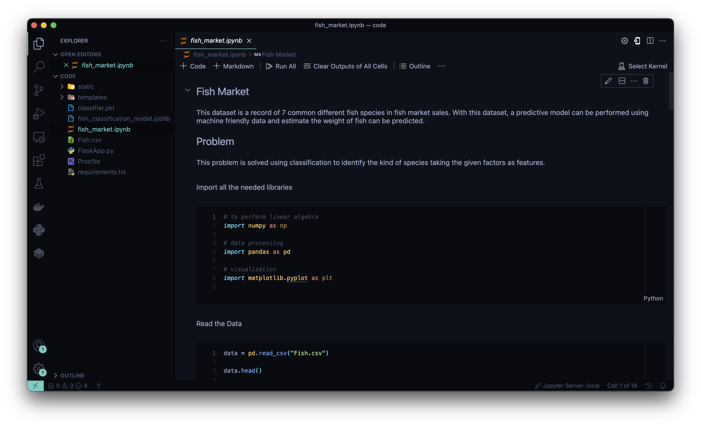
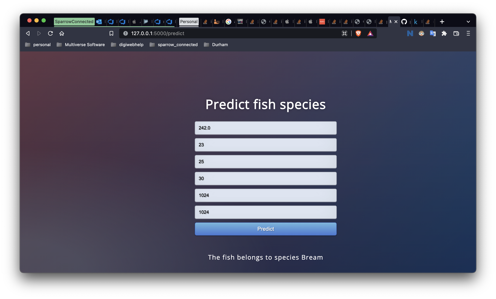

## Fish Market

This repository contains the classification model for the fish market problem: https://www.kaggle.com/aungpyaeap/fish-market

Also contains the html and css for a simple web ui for prediction of fish types.

### Content

This dataset is a record of 7 common different fish species in fish market sales. With this dataset, a predictive model can be performed using machine friendly data and estimate the weight of fish can be predicted.

### Solution

